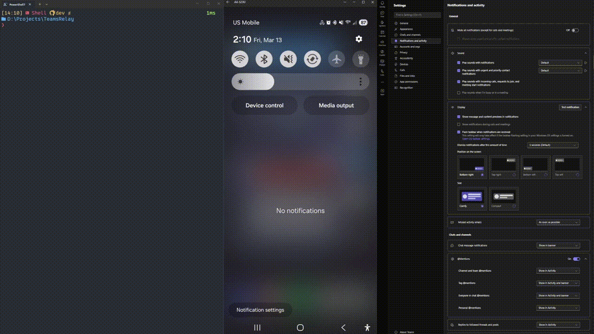

# TeamsRelay

[](LICENSE)
[](https://github.com/aawhb/TeamsRelay/releases)
<!-- [](https://github.com/aawhb/TeamsRelay/actions) -->

**Get Microsoft Teams notifications on your phone without installing Teams on your phone.**

```
Teams (on your PC)  →  TeamsRelay  →  KDE Connect  →  your phone
```

## Why TeamsRelay?

Many companies require you to install a management profile (MDM) on any device that runs company apps like Teams. Once that profile is on your phone, IT can enforce policies, track the device, or even remotely wipe it. Your personal phone effectively becomes a company phone.

TeamsRelay sidesteps all of that. It reads notification banners directly from the Teams desktop app on your Windows PC and forwards them to your phone through [KDE Connect](https://kdeconnect.kde.org/). No Teams app on the phone, no company profile, no MDM. **Your phone stays yours.**

## How It Works

TeamsRelay runs in the background on your Windows PC. When a Teams notification banner appears, it uses [Windows UI Automation](https://learn.microsoft.com/en-us/windows/win32/winauto/entry-uiauto-win32) to read the text, deduplicates and normalizes it, then sends it as a ping through KDE Connect to your paired device(s). On Android, you see the full message text. On iOS, you get a ping alert (see [Known Limitations](#known-limitations)).



## Prerequisites

- A **Windows PC** running the Microsoft Teams desktop app
- **[KDE Connect](https://kdeconnect.kde.org/)** installed on both your PC and your phone, with the two devices paired over the same network
- **`kdeconnect-cli`** available on your PC (installed automatically with KDE Connect)

That's it. The recommended self-contained package includes everything else it needs — no additional runtime or framework installs required. If you already have the matching .NET runtime installed, you can use the smaller framework-dependent package instead.

GitHub Releases include both Windows ZIP variants:

- `TeamsRelay-win-x64-self-contained-v<version>.zip` Recommended for most users
- `TeamsRelay-win-x64-v<version>.zip` Smaller, but requires the matching .NET runtime to already be installed

## Quick Start

These steps use `TeamsRelay.exe` from a published package. If you're working from a source checkout, you can use `just` or `.\tr.cmd` instead. See [Development](#development) for details.

### 1. Create a config file

```powershell
TeamsRelay.exe config init
```

This generates `config\relay.config.json` with sensible defaults. You only need to do this once. Add `--force` to overwrite an existing file.

### 2. Check your setup

```powershell
TeamsRelay.exe doctor
```

This checks that KDE Connect is reachable and your devices are paired. Fix anything it flags before continuing.

### 3. See your paired devices

```powershell
TeamsRelay.exe devices
```

If you don't see your device here, open KDE Connect on both your PC and phone and pair them first.

### 4. Start the relay

```powershell
TeamsRelay.exe start
```

TeamsRelay starts running in the background. From now on, every Teams notification banner that appears on your desktop gets forwarded to your paired device(s).

> **Tip:** If you left `deviceIds` empty in your config (the default), TeamsRelay will ask you to pick a device when it starts. To skip that prompt in the future, add your device ID to the config file. You can find it in the `devices` output.

### 5. Check that it's working

```powershell
TeamsRelay.exe status          # is the relay running?
TeamsRelay.exe logs            # what has been captured and forwarded
TeamsRelay.exe logs --follow   # watch live as notifications come in
```

### 6. Stop the relay

```powershell
TeamsRelay.exe stop
```

> **Foreground mode:** Prefer to see output directly in your terminal? Use `TeamsRelay.exe run` instead of `start`. Press `Ctrl+C` to stop.

## Configuration

TeamsRelay stores its settings in `config\relay.config.json`. Here's what the default looks like:

```json
{
  "version": 1,
  "source": {
    "kind": "teams_uia",
    "captureMode": "strict"
  },
  "target": {
    "kind": "kde_connect",
    "kdeCliPath": "kdeconnect-cli",
    "deviceIds": []
  },
  "delivery": {
    "mode": "full_text",
    "genericPingText": "New Teams activity",
    "maxMessageLength": 220,
    "filter": {
      "directMessages": true,
      "conversationMessages": true,
      "unknownTypes": true
    },
    "format": {
      "template": null,
      "directMessageTemplate": "{sender} | {message}",
      "conversationMessageTemplate": "{sender}: {message} | {conversationTitle}",
      "fallbackTemplate": "{text}"
    }
  },
  "runtime": {
    "logLevel": "info"
  }
}
```

| Setting | What it controls | Default | Notes |
| ------- | ---------------- | ------- | ----- |
| `source.kind` | Where notifications come from | `teams_uia` | Reads Teams notification banners from your screen. Leave as-is. |
| `source.captureMode` | How strictly to match notifications | `strict` | `strict` only captures clear Teams notification events. `hybrid` is more permissive. |
| `target.kind` | Where notifications go | `kde_connect` | Sends to KDE Connect. Leave as-is. |
| `target.kdeCliPath` | Path to the KDE Connect CLI tool | `kdeconnect-cli` | Only change this if `kdeconnect-cli` isn't in your system PATH. |
| `target.deviceIds` | Which device(s) to send to | `[]` (empty) | Leave empty to pick a device at startup. Or paste in device IDs from `devices` output. |
| `delivery.mode` | What to send | `full_text` | `full_text` sends the actual message text. `generic_ping` sends a generic alert instead. Useful if you want extra privacy. |
| `delivery.genericPingText` | The generic alert text | `New Teams activity` | Only used when `delivery.mode` is `generic_ping`. |
| `delivery.maxMessageLength` | Max characters per notification | `220` | Longer messages are trimmed. Range: 20–2000. |
| `delivery.filter.directMessages` | Forward one-to-one chats | `true` | Set to `false` to suppress direct-message notifications. |
| `delivery.filter.conversationMessages` | Forward group/chat notifications | `true` | Set to `false` to suppress notifications that include a sender and conversation title. |
| `delivery.filter.unknownTypes` | Forward app and unclassified notifications | `true` | Includes Viva Insights, Updates, Viva Engage/Communities, and anything the parser cannot classify confidently. |
| `delivery.format.template` | Shared output template | `null` | Used when set and no type-specific template wins. Available variables: `{sender}`, `{message}`, `{conversationTitle}`, `{text}`. |
| `delivery.format.directMessageTemplate` | Direct-message template | `"{sender} \| {message}"` | Used for inferred direct messages. Set to `null` to fall back to `delivery.format.template`. |
| `delivery.format.conversationMessageTemplate` | Group/chat template | `"{sender}: {message} \| {conversationTitle}"` | Used for inferred conversation messages. Set to `null` to fall back to `delivery.format.template`. |
| `delivery.format.fallbackTemplate` | Final formatting fallback | `"{text}"` | Uses the same cleaned text the legacy `full_text` path would have produced. If this still renders empty, TeamsRelay falls back to `delivery.genericPingText`. |
| `runtime.logLevel` | How much detail to log | `info` | Use `debug` for extra detail when troubleshooting. |

Notes:
- `unknownTypes` is broader than "malformed notifications". It also includes many Teams app notifications that do not follow a sender/message pattern.
- Templates are rendered conservatively. If a type-specific or shared template references a missing variable, TeamsRelay falls through to the next template instead of trying to clean up stray separators automatically.

## CLI Reference

| Command | What it does |
| ------- | ------------ |
| `teamsrelay run` | Run the relay in the foreground (Ctrl+C to stop) |
| `teamsrelay start` | Start the relay in the background |
| `teamsrelay stop` | Stop the background relay and clean up related processes |
| `teamsrelay status` | Check whether the relay is running |
| `teamsrelay devices` | List paired KDE Connect devices |
| `teamsrelay logs` | View the notification log |
| `teamsrelay logs --follow` | Follow the log live |
| `teamsrelay doctor` | Run a health check on your setup |
| `teamsrelay config init` | Create a default config file |
| `teamsrelay --help` | Show help |
| `teamsrelay --version` | Show version |

<details>
<summary>Full CLI syntax</summary>

```
teamsrelay run [--device-name <name>]... [--device-id <id>]... [--config <path>]
teamsrelay start [--device-name <name>]... [--device-id <id>]... [--config <path>]
teamsrelay stop [--timeout-seconds <n>] [--force]
teamsrelay status
teamsrelay devices [--config <path>]
teamsrelay logs [--follow]
teamsrelay doctor [--config <path>]
teamsrelay config init [--path <path>] [--force]
teamsrelay --help
teamsrelay --version
```

</details>

## Known Limitations

| Limitation | Details |
| ---------- | ------- |
| **iOS shows generic ping only** | KDE Connect on iOS displays "Ping received from a connected device" instead of the actual message text. This is a [KDE Connect iOS limitation](https://apps.apple.com/app/kde-connect/id1580245991), not a TeamsRelay issue. Android devices show the full message content. |
| **Windows only** | TeamsRelay uses Windows UI Automation APIs to read notification banners. It doesn't run on macOS or Linux. |
| **Teams desktop app only** | Notifications must come from the Teams desktop app. Teams in a browser won't trigger captures. |

## Troubleshooting

**"No devices found"**
Open KDE Connect on both your PC and your phone. Make sure they're on the same Wi-Fi network and paired. Then run `devices` again. If your device shows up but `doctor` still reports a problem, check that `kdeconnect-cli` is in your PATH (try running `kdeconnect-cli -l` in a terminal).

**Notifications aren't appearing on my phone**
Make sure Teams is showing desktop notification banners (not just taskbar badges). Check *Settings → Notifications* in Teams. Also verify that KDE Connect on your phone has notification permissions enabled.

**"kdeconnect-cli" is not recognized**
KDE Connect usually installs this tool automatically. If your system can't find it, locate where KDE Connect is installed and either add that folder to your PATH or set the full path in your config under `target.kdeCliPath`.

**The relay stops on its own**
Check the logs for error details. Common causes: Teams was closed, KDE Connect was disconnected, or the PC went to sleep.

**A forwarded notification has repeated text**
TeamsRelay normalizes common Teams patterns where sender/message/chat name get duplicated in the same banner. If you still see odd text, switch `runtime.logLevel` to `debug`, reproduce it, and check `runtime\logs\relay.log` for the raw payload.

## Runtime Files

TeamsRelay stores working files under `runtime\`. You generally don't need to touch these. They're managed automatically.

| File | Purpose |
| ---- | ------- |
| `runtime\logs\relay.log` | Captured and forwarded notifications (one JSON entry per line) |
| `runtime\state\relay.pid` | Process ID of the running relay |
| `runtime\state\relay.meta.json` | Metadata about the current relay session |
| `runtime\state\relay.stop` | Signal file for graceful shutdown |

## Development

This section is for developers building from source or contributing to TeamsRelay.

### Requirements

- [.NET 9 SDK](https://dotnet.microsoft.com/download)
- Optionally, [`just`](https://github.com/casey/just) as a command runner (otherwise use `.\tr.cmd`)

### Building and testing

```powershell
just build          # compile the solution
just test           # run the test suite
just ci             # build + test in one step
```

Or with `dotnet` directly:

```powershell
dotnet build TeamsRelay.sln
dotnet test tests/TeamsRelay.Tests/TeamsRelay.Tests.csproj
```

### Running from source

```powershell
just start                  # start the relay
just stop                   # stop it
just doctor                 # health check
just devices                # list devices
just logs                   # view logs
just cli <any args>         # pass arbitrary CLI arguments
```

### Publishing

**Self-contained** (recommended for distribution, includes everything, no .NET install needed):

```powershell
just publish-self-contained
```

Output: `artifacts\publish-self-contained\TeamsRelay.exe`

**Framework-dependent** (smaller, requires .NET 9 runtime on the target machine):

```powershell
just publish
```

Output: `artifacts\publish\TeamsRelay.exe`

### Project structure

```
src/
  TeamsRelay.App/                          CLI entry point, commands, device selection
  TeamsRelay.Core/                         Config, pipeline, state, logging, relay loop
  TeamsRelay.Source.TeamsUiAutomation/      Reads Teams notification banners via UI Automation
  TeamsRelay.Target.KdeConnect/            KDE Connect device discovery and message delivery
tests/
  TeamsRelay.Tests/                        Unit tests (xUnit)
scripts/
  Invoke-TeamsRelay.ps1                    PowerShell launcher with auto-build
```

<!-- TODO: Add architecture diagram here -->

## Contributing

Contributions are welcome! Here's how to help:

- **Found a bug?** [Open an issue](../../issues) with steps to reproduce.
- **Have an idea?** Open an issue to discuss before building.
- **Want to submit code?** Fork the repo, make your changes, and open a pull request. Please run `just ci` (or `dotnet build && dotnet test`) before submitting to make sure everything passes.

When in doubt, follow the patterns you see in the existing code.

## License

[GPL-3.0-only](LICENSE)
